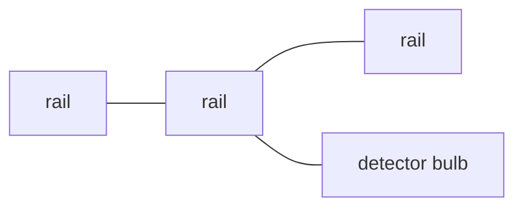
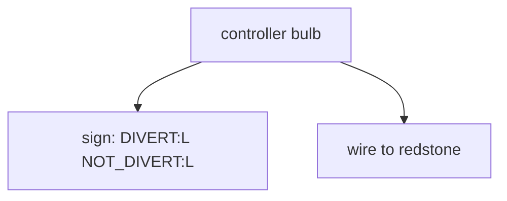
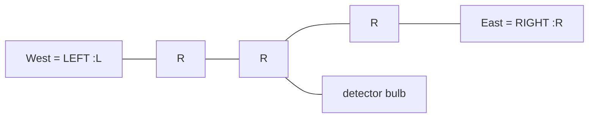
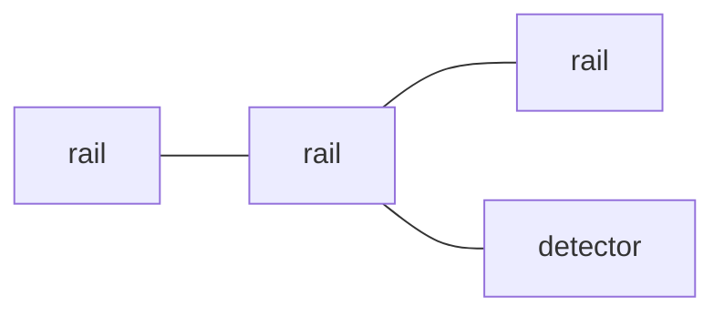
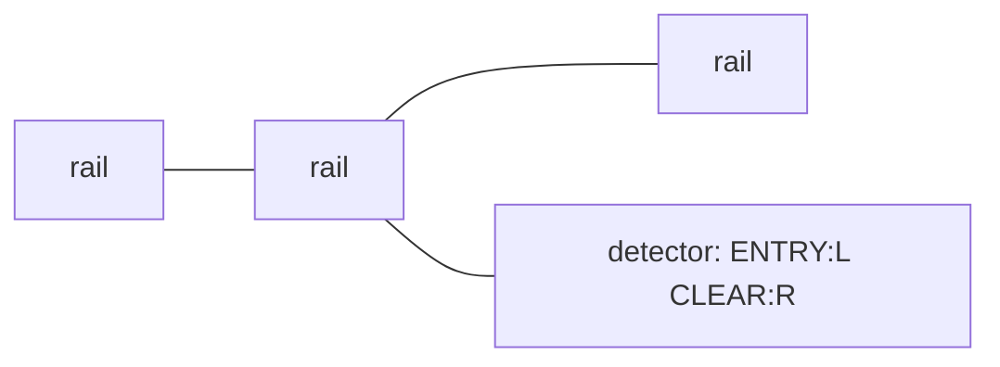
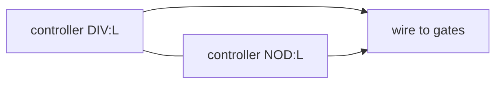
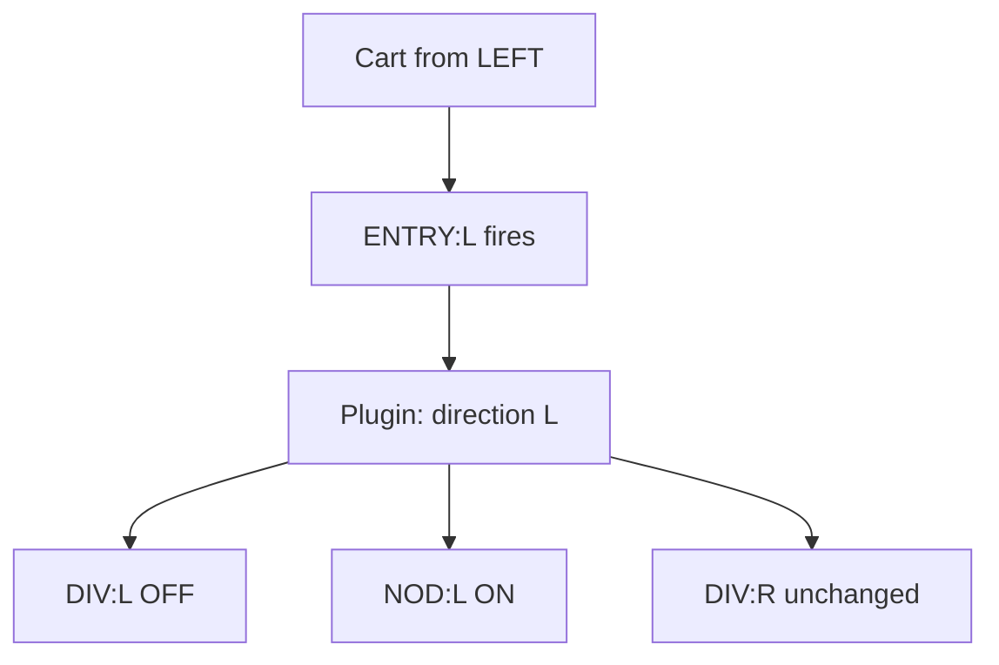
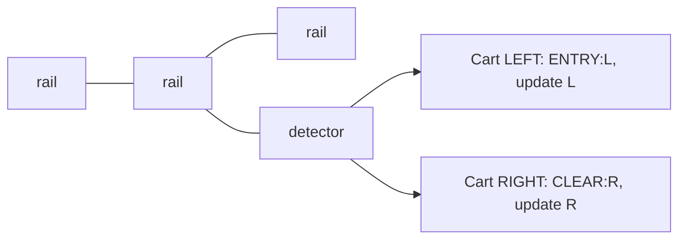

# Detectors & Controllers — Plain-Language Guide

This doc explains how Netro’s detector/controller logic works in everyday terms. It’s meant for people who want to set up or explain the system without reading code.

**Diagrams:** The diagrams in this guide use [Mermaid](https://mermaid.js.org/). They render on GitHub, GitLab, and in editors that support Mermaid (e.g. VS Code with a Mermaid extension). If you only see code blocks, open the file on GitHub or use a Mermaid-capable viewer.

---

## Big picture

- A **detector** is a copper bulb (with a sign) next to a rail. When a cart passes that rail, the detector “sees” it and can trigger rules.
- A **controller** is another copper bulb (with a sign) that the plugin can turn **on** or **off**. You wire that bulb to your redstone (switches, gates, etc.).
- **Rules** on the detector sign say *when* something happens (e.g. “when a cart comes from the left”).  
- **Roles** on the controller sign say *what* that controller does when the plugin flips it (e.g. DIVERT `"DIV"` = send cart into the siding).

**Direction (L/R)** ties them together: the detector figures out “left” or “right” from the sign and the cart’s movement; the plugin only flips controllers whose direction matches.

**Names on signs:** You can write the full rule/role name or a shorthand. The doc uses the full name and shows the shorthand in quotes where it helps (e.g. ENTRY `"ENT"`, CLEAR `"CLE"`, DIVERT `"DIV"`, NOT_DIVERT `"NOD"`). Direction is always **:L** (left) or **:R** (right).

### Visual: Detector vs controller (same block type, different job)

**DETECTOR** — copper bulb block **beside a rail**. The rail is where the cart runs; the plugin “sees” the cart when it’s on that rail.

**CONTROLLER** — copper bulb block **anywhere you want** (e.g. at your switch or gate). No rail next to it. You wire the bulb to your redstone.

---

## How “direction” works (LEFT vs RIGHT)

- Every detector and controller sign has a **facing** in the world (which way the sign points).
- From that facing, the plugin defines **LEFT** and **RIGHT** as the two sides (e.g. sign facing North → LEFT = West, RIGHT = East).
- When a cart passes a detector, the plugin looks at which way the cart is moving and turns that into **cart direction**: either **LEFT** or **RIGHT** (relative to that sign).
- So:
  - **“From the left”** = cart is moving in the direction that counts as LEFT for that detector’s sign.
  - **“From the right”** = cart is moving in the direction that counts as RIGHT.

When a rule has **:L** or **:R** (e.g. ENTRY:L `"ENT:L"`, DIVERT:L `"DIV:L"`), it means “only when the cart direction is LEFT” or “only when the cart direction is RIGHT.”

### Visual: Sign on one side of the block, LEFT and RIGHT on the other

**Top-down view (bird’s eye).** Rail runs east–west. The copper bulb block (detector) is beside the rail. The sign is on one face of the block; the plugin uses that facing to define LEFT and RIGHT.

So when the **sign faces North** (for example):

- **LEFT** = West (counter‑clockwise from sign facing).
- **RIGHT** = East (clockwise from sign facing).

A cart moving **west** along the rail past this detector is “from the left” (**:L**). A cart moving **east** is “from the right” (**:R**).

### Visual: Rail + detector — blocks and cart direction

**Top-down.** Rail blocks in a row; one copper bulb block beside the rail. Cart direction = LEFT (:L) or RIGHT (:R).

---

## Example: Terminal detector — ENTRY → DIVERT / NOT_DIVERT

This example uses a **terminal** detector and controllers that use **DIVERT** `"DIV"` (divert) and **NOT_DIVERT** `"NOD"` (don’t divert). Same idea applies to transfer nodes for “pass through”; junctions add extra logic (see later).

### Step 1: What you have

- A **detector** at a terminal (copper bulb + sign next to the rail).  
  On the sign you put something like: **Line 1:** `[Terminal]`, **Line 2:** `StationName:NodeName`, **Lines 3–4:** rules. A typical setup uses **one rule per direction**, e.g. **ENTRY:L** `"ENT:L"` (when a cart enters from the left) and **CLEAR:R** `"CLE:R"` (when a cart clears from the right)—not the same rule twice for L and R.
- One or more **controllers** for that same terminal (other copper bulbs + signs).  
  On those you put **Line 1:** `[Controller]`, **Line 2:** same `StationName:NodeName`, **Lines 3–4:** roles like **DIVERT:L** `"DIV:L"`, **NOT_DIVERT:L** `"NOD:L"`, **DIVERT:R** `"DIV:R"`, **NOT_DIVERT:R** `"NOD:R"`.

**Layout (detector at rail, controllers elsewhere):**

### Step 2: What “ENTRY:L” and “CLEAR:R” mean on the detector

- **ENTRY** `"ENT"` = “a cart is entering this node” (it passed this detector’s rail).
- **CLEAR** `"CLE"` = “a cart is clearing this node” (it left the detector’s rail / segment).
- **:L** or **:R** = “only when the cart is coming **from the left**” or “**from the right**” (relative to this detector’s sign).

So:

- **ENTRY:L** `"ENT:L"` = “When a cart passes this detector **from the left direction**, run the ENTRY logic.”
- **CLEAR:R** `"CLE:R"` = “When a cart passes this detector **from the right direction**, run the CLEAR logic.”
- You’d typically have different rules per direction (e.g. ENTRY:L and CLEAR:R), not the same rule for both.
- A rule with no **:L** or **:R** = “Run this rule no matter which direction the cart is going.”

The **:L** or **:R** on the **detector** is the **trigger condition**: “only fire this rule when the cart is moving in that direction.”

### Step 3: What happens when ENTRY fires (terminal)

For a **terminal** (and for a transfer node), when **ENTRY** runs the plugin does the same thing every time: “cart is passing through, don’t divert.”

So it:

- Turns **off** any controller that has **DIVERT** `"DIV"` (or DIVERT+ `"DIV+"`) for that direction.
- Turns **on** any controller that has **NOT_DIVERT** `"NOD"` (or NOT_DIVERT+ `"NOD+"`) for that direction.

The “direction” used here is the **cart’s direction** (LEFT or RIGHT) that made the detector rule fire.

So:

- When a cart passes **from the left** and the detector has **ENTRY:L** `"ENT:L"`:
  - The plugin looks for controllers for this terminal that have **DIVERT:L** `"DIV:L"` or DIVERT+:L → it turns those **off**.
  - It looks for controllers that have **NOT_DIVERT:L** `"NOD:L"` or NOT_DIVERT+:L → it turns those **on**.
- When a cart passes **from the right** and the detector has a rule that fires for right (e.g. **CLEAR:R** `"CLE:R"`), CLEAR does different things (it can turn off the “+” controllers); the important part is that **the direction that fired** is used to pick which controllers get updated.

So:

- **ENTRY:L** `"ENT:L"` on the detector → “when a cart comes from the left, set the **L** controllers: DIVERT:L off, NOT_DIVERT:L on.”
- A rule with **:R** on the detector → when a cart comes from the right, the plugin updates only the **:R** controllers (DIVERT:R, NOT_DIVERT:R, etc.).

That’s the link: **detector direction (:L or :R) decides when the rule runs; the same direction is used to pick which controllers (DIVERT:L, NOT_DIVERT:L, etc.) get updated.**

### Step 4: What “DIVERT:L” and “NOT_DIVERT:L” mean on a controller

- **DIVERT** `"DIV"` = “this controller is the ‘divert’ switch” (e.g. send cart into the siding).
- **NOT_DIVERT** `"NOD"` = “this controller is the ‘don’t divert’ switch” (e.g. keep cart on the main line).
- **:L** = “this controller is used when the **cart direction is LEFT**.”

So:

- A controller with **DIVERT:L** `"DIV:L"` is the “divert” switch for carts coming **from the left**. When the plugin wants “don’t divert for left,” it turns that controller **off**.
- A controller with **NOT_DIVERT:L** `"NOD:L"` is the “don’t divert” switch for carts coming **from the left**. When the plugin wants “don’t divert for left,” it turns that controller **on**.

So:

- **ENTRY:L** `"ENT:L"` on the detector → “cart came from the left” → plugin sets DIVERT:L off and NOT_DIVERT:L on → the controller with **DIVERT:L** goes off, the one with **NOT_DIVERT:L** goes on.

### Step 5: Saying it in one sentence

- **“ENTRY:L on the detector”** (or `"ENT:L"`) means: *When a cart passes this detector from the left, the plugin turns off any controller that has DIVERT:L `"DIV:L"` and turns on any controller that has NOT_DIVERT:L `"NOD:L"` (so the cart goes straight through).*
- A rule with **:R** does the same for “from the right” and controllers with **DIVERT:R** `"DIV:R"` / **NOT_DIVERT:R** `"NOD:R"`.

So the flow is:

1. Cart passes the detector in a direction (left or right).
2. Detector rule (e.g. ENTRY:L `"ENT:L"` or CLEAR:R `"CLE:R"`) only runs if the direction matches.
3. When it runs, the plugin uses that **same** direction to choose which controllers to flip (DIVERT:L vs DIVERT:R, NOT_DIVERT:L vs NOT_DIVERT:R).
4. You wire those controllers to your redstone so “DIVERT off + NOT_DIVERT on” = cart goes straight, etc.

### Visual: Flow from detector to controllers (ENTRY:L example)

(The detector is the copper bulb block beside the rail; when the cart is on that rail, the plugin runs the matching rule.)

### Visual: One detector, two directions — who gets updated?

Same **rail + one detector block**; cart can come from either direction. Which rule fires depends on direction.

---

## Summary table (terminal ENTRY → DIVERT / NOT_DIVERT)

| Detector rule | Shorthand | Meaning | What the plugin does (for ENTRY) |
|---------------|-----------|---------|----------------------------------|
| **ENTRY:L** | `"ENT:L"` | “When a cart passes this detector **from the left**” | Turns **off** controllers with **DIVERT:L** `"DIV:L"` (and DIVERT+:L). Turns **on** controllers with **NOT_DIVERT:L** `"NOD:L"` (and NOT_DIVERT+:L). |
| **ENTRY:R** | `"ENT:R"` | “When a cart passes **from the right**” | Same for **:R** controllers (DIVERT:R off, NOT_DIVERT:R on). |
| **ENTRY** (no L/R) | `"ENT"` | “When a cart passes in **any** direction” | Does the same for both directions (all matching DIVERT/NOT_DIVERT controllers). |

So: **ENTRY:L** only cares about carts from the left and only touches controllers marked with **:L**; a **:R** rule only touches **:R** controllers. That way left and right don’t interfere with each other. Detectors often use **one rule per direction** (e.g. ENTRY:L and CLEAR:R) rather than the same rule for both.

---

*This guide started with terminal ENTRY and DIVERT/NOT_DIVERT. More rules (READY `"REA"`, CLEAR `"CLE"`, ROUTE `"ROU"`, TRANSFER `"TRA"` / NOT_TRANSFER `"NOT_TRA"`, etc.) can be added in the same style: detector rule + direction → when it runs → which controllers (with matching role and direction) get set on or off.*
