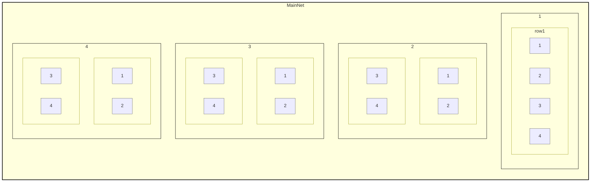
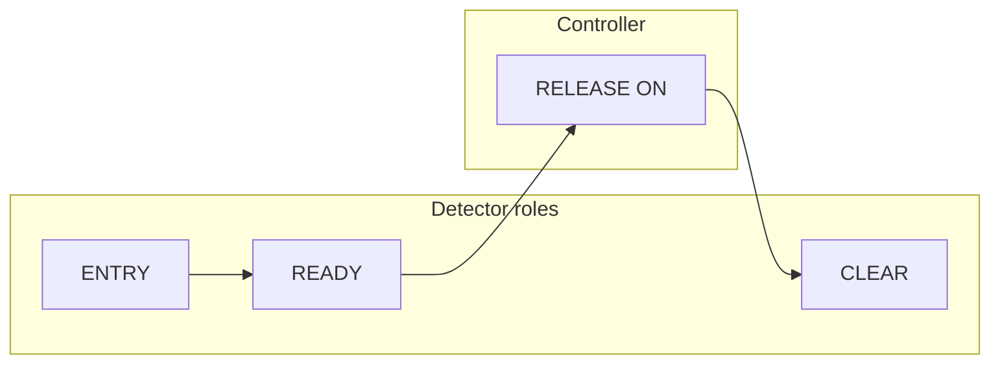

# Netro — Rail Network Plugin Guide

This guide describes how the Netro plugin works, how to set it up, and how to use the GUI and rules. It is based on the current codebase behavior. **§2.2** explains what the plugin does **automatically** when certain events happen (e.g. READY holding the cart at the terminal, no-route redirect, first-seen cart), so you know what to expect from the “black box.”

---

## 1. What Netro Is and Why It Exists

Netro is a Minecraft (Bukkit/Spigot 1.21–1.21.11) plugin for **rail networks**: stations, transfer nodes, terminals, and cart routing. It lets you:

- Define **stations** with 2D hierarchical addresses (e.g. `OV:E2:N3:01:02:05` for Overworld, `NE:W1:S2:02:03:01` for Nether).
- Attach **transfer nodes** (switches between lines) and **terminals** (parking slots at a station) to stations.
- Use **detector rails and copper bulbs** with signs to trigger **rules** (e.g. set cart speed, power controllers, change rail shape, set destination when blocked).
- Route carts by **destination address** (station or station + terminal index) using **shortest-path pathfinding**; results are cached so repeat lookups don't recompute (see §2.1.1). When there are multiple routes to the same station, the cost includes **address distance** (mainnet → cluster → localnet → station), so paths that step through stations “closer” in the hierarchy to the destination are preferred (like traceroute); pairs that connect different clusters or mainnets are used naturally without designating default gateways.

Carts are tracked in a database (SQLite) so that routing, rules, and “held” state at terminals work across chunk loads and server restarts. There is no collision detection between carts; dispatch is only blocked when the destination is invalid or when it is a **terminal** that already has a cart held (one slot per terminal); transfer nodes do not track occupancy.

---

## 2. Concepts

- **Station** — A named location with a unique address (e.g. `OV:E2:N3:01:02:05` Overworld, `NE:W1:S2:02:03:01` Nether). Created by placing a sign; the first part is **dimension** (`OV` = Overworld, `NE` = Nether); then mainnet X/Z, **cluster quad** (01–04), **localnet quad** (01–04), and station index (6-part). Quadrants from sign of local X,Z: NegX+PosZ=1, PosX+PosZ=2, NegX+NegZ=3, PosX+NegZ=4.
- **Transfer node** — A switch at a station that can be **paired** to another transfer node at another station (pairs can be cross-dimension: Overworld ↔ Nether) (the “other side” of the track). Carts can be routed “via” that pair to reach the other station.
- **Terminal** — A parking slot at a station. Each terminal has an index (0-based). A cart’s destination can be a station (any terminal) or a specific terminal (e.g. `OV:E2:N3:01:02:05:01` or `StationName:Term1`).
- **Detector** — A sign on a **copper bulb** next to a rail. When a cart passes the rail, the detector “fires” with a **role** and **direction** (see below).
- **Controller** — A sign on a copper bulb that can be turned ON/OFF by rules (e.g. RELEASE to release a held cart, or RULE:N to match rule index N).
- **Rules** — Stored per transfer node or terminal. Each rule has a **trigger** (ENTERING, CLEARING, DETECTED, BLOCKED), an optional **destination condition** (going to / not going to a specific destination, or any / not any), and an **action** (e.g. set cruise speed, SEND_ON, SEND_OFF, set rail state, set destination when blocked).

### 2.1 Address system (coordinates → address)

Addresses are derived from the station sign’s **block X**, **block Z**, and **dimension** (Overworld vs Nether). Format is **colon-separated** with **OV** (Overworld) or **NE** (Nether), mainnet **X** and **Z** separate, then cluster, localnet, station (and optional terminal)—all numeric parts **2 digits** (01–04 for quadrants, 01–99 for station/terminal).

**Hierarchical allocation (not geometric quadtree):** TOTAL = aggregate linear allocation of its 4 children. Only rule: **child_total = parent_total ÷ 4**. MainNet total = 1600 → 4 Cluster Quads (2×2) → each 400. Cluster total = 400 → 4 LocalNet Quads (2×2) → each 100. 2×2 defines structure (4 children), not side-length or area math.

**Format:** **Station** = `OV:E2:N3:01:02:05` (dim:mainnetX:mainnetZ:cluster:localnet:station). **Terminal** = station + `:01` (e.g. `OV:E2:N3:01:02:05:01`). Dimension **OV** / **NE**. Mainnet **E/W** + number for X, **N/S** + number for Z. Cluster, localnet, station, terminal = **01–04** or **01–99**.

| Level     | Size   | Example part | Meaning |
|----------|--------|--------------|--------|
| Dimension | —      | `OV` / `NE`  | Overworld / Nether. |
| Mainnet X | 1600 m | `E2`         | East 2 (W = West, negative). |
| Mainnet Z | 1600 m | `N3`         | North 3 (S = South, negative). |
| Cluster quad | 200×200 m | `01`–`04` | Quadrant by position (total 400 = 1600÷4). |
| Localnet quad | 100×100 m | `01`–`04` | Quadrant by position (total 100 = 400÷4). |
| Station  | —      | `05`         | 5th station in that 100m×100m cell (1-based, 2-digit). |
| Terminal | —      | `01`         | First terminal at that station (2-digit, optional 7th part). |

So **OV:E2:N3:01:02:05** = Overworld, mainnet (2,-3), cluster 01, localnet 02, 5th station. Terminal = **OV:E2:N3:01:02:05:01**.

**2D addressing:** The **Railroad Controller** boss bar shows **R** = region (e.g. `OV:E2:N3:01:02`), then Local and World coordinates. The boundary grid uses 400 / 200 / 100 m in X and Z.

**Boundary grid (Railroad Controller):** Red = mainnet (every 400 m), cyan = cluster (every 200 m), green = localnet (every 100 m). Each tier is drawn at a slightly different height. Cluster (cyan) lines only appear where they’re not also a mainnet line.

Only the **colon address format** (6-part station, 7-part terminal) is supported. On first run after updating, a **migration** recomputes every station’s address from its sign position and updates the database and signs (see §2.1.2).

### 2.1.1 Nether support: pairing and routing

Stations can be in the **Nether** as well as the Overworld. A transfer node at an **Overworld** station can be **paired** to a transfer node at a **Nether** station (and vice versa); you place the portals and rails, the plugin routes across the pair.

**Routing cost (experienced blocks):** Cost = 1 + number of blocks traveled; 1 block in any dimension = 1 cost (no 8× factor). So paths are comparable by “how far the cart actually travels.”

- **Same dimension:** Cost = 1 + horizontal block distance (Overworld or Nether).
- **Portal hop (OW ↔ Nether):** Cost = leg in origin dimension + blocks through the Nether + leg in destination dimension (each block = 1 cost). Portal positions (when linked) are used to measure legs.

Paths through the Nether can still be shorter when the Nether leg is short compared with a long Overworld path.

**Route cache:** Shortest-path results are cached so repeat lookups don’t recompute. Cache TTL is based on **Minecraft world time** (ticks), not real time—so entries don’t expire while the server is off. Expired entries are still used (stale-while-revalidate) and refreshed in the background. A single queue runs at most one pathfinding per 10 ticks. Optionally, all reachable station pairs are enqueued for refresh every 30 minutes so the cache stays warm. **`/netro clearcache`** clears all cached routes and the refresh queue.

### 2.1.2 Migration (existing worlds)

On first run after updating, the plugin **migrates** existing data to the 2D address system:

1. **Dimension column** — If missing, adds a `dimension` column to stations and backfills it from each station’s world (Overworld vs Nether).
2. **2D address migration** — For every station that still has an old address format, the plugin recomputes the correct **2D address** from the sign’s block position (dimension, X, Z). Each 100m×100m cell is uniquely identified by (cx, cz, lx, lz). Stations in the same cell are ordered deterministically (by X, Z, Y, creation time) and assigned indices 1, 2, 3, … in that cell. The database and the **sign in the world** are both updated with the new address.
3. **Cart destinations** — Any cart whose stored destination is in the old format has its destination cleared (so routing uses only 2D addresses; you set destinations again after migration).
4. **Sign sync** — All station signs in the world are updated to show the address stored in the database.

After migration, every station has a **6-part** colon address (e.g. `OV:E2:N3:01:02:05`); terminals are **7-part** (station + colon + terminal index, e.g. `OV:E2:N3:01:02:05:01`). Only the colon format is used; legacy dot-format terminal addresses are no longer produced.

### 2.2 What the plugin does automatically

The plugin takes a number of actions on its own when certain events happen. Understanding these helps you predict behavior and design your network. (In the future some of these may become configurable or user-controlled; for now they are fixed.)

| When this happens | What the plugin does (automatically) |
|-------------------|--------------------------------------|
| **A detector sees a cart that is not yet in the database** | Adds the cart to the database. Sets a destination if it can: if the cart is leaving a transfer (CLEAR) toward a paired station that has a terminal → destination = that station’s terminal; else → destination = nearest station (by distance) that has an available terminal; if no terminals exist → no destination. |
| **At a station, the cart has no destination** | Applies the “no-destination” rule: sets destination to an available terminal at the current station, or at another station; if there are **no terminals anywhere** → removes the cart from the database and **despawns** the cart entity. |
| **At a station, the cart has a destination but there is no route to it** | Sets the cart’s destination to the **nearest available terminal** (current station first, then others). Notifies: **full-screen title** if a player is in the cart, **chat message** if the cart is unmanned. |
| **The READY detector fires (terminal)** | There is **one READY detector per terminal**. When a cart passes it: the plugin marks the cart as **held** at that terminal (zone). **Held** is driven by detection: while the READY detector is actively seeing a cart, held is true; when the cart leaves detection, a **5-second timeout** starts—after 5 seconds held is set false and RELEASE is turned off, unless **CLEAR** fires first (cart leaves in the clear direction), in which case held is set false immediately and the timeout is cancelled. If the cart’s destination is **this terminal** → clears destination (arrived). If it’s **this cart’s turn** to be released (and it has a valid other destination and can dispatch), turns **RELEASE** controllers ON so your mechanism can release the cart. Runs a **short center hold**: for about **1 second** the plugin applies velocity correction so the cart is **pulled toward the center** of the detector rail and kept there. The cart **stays at the terminal** until it’s its turn to be released, has a destination (that isn’t this terminal), and RELEASE is turned on and the cart physically leaves (then CLEAR fires). |
| **The CLEAR detector fires (cart leaving a terminal)** | Sets held false for this terminal (and cancels the 5s timeout if it was running); clears this cart’s “held” state; turns **OFF** all RELEASE controllers for that node. If another cart is held at that terminal (e.g. just arrived at READY), turns RELEASE **ON** for that cart if appropriate. |
| **The next hop is blocked (e.g. destination terminal full) and no BLOCKED rule applies** | Uses the **default blocked policy**: redirects the cart to an available terminal at the current station, or at another station, or to another transfer node at the current station that isn’t occupied. You can override this with a **BLOCKED** rule that sets a specific redirect destination. |

So: the **READY** detector (one per terminal) both “attracts” the cart to the center for ~1 second and keeps the cart **at the terminal** until the plugin decides to release it (when it’s this cart’s turn, it has a destination, and RELEASE is on). The cart only leaves when your release mechanism is powered and the cart passes the detector again in the clearing direction (CLEAR).

---

## 3. Setting Up a Station

Stations are **created and removed only by signs**; there is no station create/delete command.

1. Place a **wall sign** (or sign post) where you want the station’s reference point.
2. Line 1: **`[Station]`** (exact, any case).
3. Line 2: **Station name** (e.g. `Hub`, `Snowy2`). Must be unique.
4. Finish editing the sign.

The plugin assigns an **address** from the sign’s block position (hierarchical: mainnet.cluster.localnet.station) and writes it on the sign. Breaking the sign **removes** the station and its address.

- **Chunk loading:** The plugin keeps chunks loaded for detector rails that need to see carts; station and detector positions are used for this.

---

## 4. Detectors and Nodes: [Transfer], [Terminal], [Detector]

Detectors are signs placed on **copper bulbs** that are **adjacent to a rail**. When a cart passes that rail, the detector fires. The sign’s first line determines the type and what roles are allowed.

### 4.1 Sign Types

| Line 1       | Line 2          | Purpose |
|-------------|------------------|--------|
| **`[Transfer]`** | `StationName:NodeName` | Boundary detector for a **transfer node**. If the node does not exist, it is created. Allowed roles: **ENTRY**, **CLEAR**. |
| **`[Terminal]`** | `StationName:NodeName` | Boundary detector for a **terminal**. If the node does not exist, it is created. Allowed roles: **ENTRY**, **CLEAR**, **READY** (at most one READY per terminal). |
| **`[Detector]`** | `StationName:NodeName` or node name | Generic detector tied to an existing node. Allowed roles: ENTRY, READY, CLEAR. |

- **Line 2** for [Transfer] and [Terminal] must be **`StationName:NodeName`** (e.g. `Hub:Main`, `Snowy2:PlatformA`). The station must already exist. If the node does not exist, it is created when you place the sign.
- The **copper bulb** must be **next to a rail**; otherwise the plugin tells you to place the bulb adjacent to a rail.
- Breaking the sign (or the bulb) unregisters the detector.

### 4.2 Roles on the Detector Sign (Lines 3–4)

Roles are written on lines 3 and 4, space-separated. You can add a **direction** so the role only fires when the cart is moving that way (e.g. **ENTRY L** = entering from the left, **CLEAR R** = clearing to the right). Shorthand: **ENT**, **REA**, **CLE**, **REL**; directions **L** / **R** (or LEFT / RIGHT).

- **ENTRY** — Fires when the cart passes the detector in the “entering” direction (into the node). Direction is optional; if set (e.g. `ENTRY L`), it only fires when the cart’s direction matches.
- **CLEAR** — Fires when the cart passes in the “clearing” direction (leaving the node). **Direction is respected**: e.g. `CLEAR R` only fires when the cart is actually leaving to the right, not when entering from the left.
- **READY** — (Terminals only.) **One READY detector per terminal.** When a cart passes it, the terminal **holds** the cart (cart is “at” that terminal). Used with **RELEASE** on controllers to release the cart when it’s its turn to leave.
- **RELEASE** — Used on **controller** signs (see below), not on detectors. Controllers with RELEASE are turned ON when the routing logic decides to release a cart from that terminal.

Only **ENTRY** and **CLEAR** apply rules; **READY** detectors do not run the rule engine.

So: **entry vs clear** is determined by **direction**. One detector can have both `ENTRY L` and `CLEAR R` (or no direction for “any direction” for ENTRY/CLEAR where the code allows it). The important fix for “set cruise speed on CLEAR” is that CLEAR now only fires when the cart’s direction matches the rule’s direction (e.g. clearing to the right), not when entering.

---

## 5. Controllers

A **controller** is a sign on a copper bulb that the plugin can power ON or OFF. Used for:

- **RELEASE** — Release mechanism at a terminal. When the plugin decides “release the next cart from this terminal,” it turns ON controllers that have **REL** (RELEASE) on their sign. Usually wired to a mechanism that lets the cart leave the hold area.
- **RULE:N** — N is a rule index (0, 1, 2, …). When a rule with action **SEND_ON** or **SEND_OFF** fires, the plugin finds controllers with **RULE:N** for that node and sets them ON or OFF. Optional direction: **RULE:0:L** / **RULE:0:R**.

Controller sign: Line 1 **`[Controller]`**, Line 2 **StationName:NodeName** (same as detectors). Lines 3–4: at least one of **REL** or **RULE:N** (with optional :L/:R).

---

## 6. Terminals: ENTRY, CLEAR, READY, and RELEASE

Terminals are “parking slots” at a station. The flow is:

- **ENTRY** and **CLEAR** are detector roles (when the cart passes the sign). **READY** is a detector role that marks "cart held in slot." **RELEASE** is a controller output (plugin turns the bulb ON to release the next cart).

1. **ENTRY** — Cart passes a detector in the “entering” direction. No slot booking; just used for rules (e.g. “when entering and going to X, set speed”).
2. **READY** — Cart passes the **READY** detector (**one per terminal**). The plugin:
   - Marks the cart as **held** at that terminal (zone `node:<nodeId>`). **Held** is detection-based: true while the detector sees a cart; when the cart leaves detection, a **5-second timeout** starts—after 5s held becomes false and RELEASE turns off, unless **CLEAR** fires first (then held is set false immediately and the timeout is cancelled).
   - If the cart’s destination is **this terminal**, destination is cleared (cart arrived).
   - Decides whether it’s **this cart’s turn** to be released (by order and “release reversed” setting). If yes and the cart has a valid destination (and dispatch is allowed), it turns **RELEASE** controllers ON so the mechanism can release this cart.
   - Schedules a short “center hold” so the cart stays near the detector for about a second (READY hold).
3. **CLEAR** — Cart passes the detector in the “clearing” direction (leaving the terminal). The plugin:
   - Sets held false for this terminal (cancels the 5s timeout if it was running).
   - Clears the cart’s “held” state.
   - Turns OFF all RELEASE controllers for that node.
   - If another cart is held at that terminal, it turns RELEASE ON for that cart if appropriate.

For the full list of automatic actions (including the READY center hold and when the cart is kept at the terminal until it has a destination and is released), see **§2.2**.

So: **READY** = “cart has entered the terminal and is held” (one READY detector per terminal); **RELEASE** = “power the release mechanism when it’s this cart’s turn to leave”; **CLEAR** = “cart has left the terminal, held set false, timeout cancelled, turn off release.”

---

## 7. Pairing Transfer Nodes

Transfer nodes at two different stations can be **paired**. Routing uses these pairs to compute paths (e.g. “from station A, first hop toward station B is this transfer node, because it’s paired to a node at B”).

1. Open **Railroad Controller** (from `/netro railroadcontroller`).
2. **Right-click the [Station] sign** of the station that has the transfer node you want to pair.
3. In the station menu, click the **transfer node** (not a terminal).
4. Click **Open rules**.
5. In the Rules screen, click **Pair transfer node…**.
6. Choose the **other station** and then the **other node**. Confirm.

Both nodes now reference each other. Unpairing is done in the same Rules UI (confirm unpair). Routing uses cached paths when available; no manual “rebuild routes” step is needed. Use **Routes** (slot 50) in the Rules screen to view or clear cached routes for that station/node, or **`/netro clearcache`** to clear everything.

---

## 8. Rules UI and Creating Rules

### 8.1 Opening the Rules UI

- **Sneak + right-click** a **[Transfer]** or **[Terminal]** sign (the sign on the copper bulb).  
  This opens the **Rules** screen for that detector’s node (transfer or terminal).

You can also reach rules from the **station menu**: Railroad Controller → right-click [Station] sign → click a node. That opens **Node Options** (Open rules, Relocate, Delete). Click **Open rules** for the Rules screen, or **Relocate** to move this node’s detector/controller without opening rules.

### 8.2 Rules Screen Layout

- **Slots 0–44** — List of existing rules (by rule index).
- **Slot 45** — “Default blocked policy” (when the chosen next hop is blocked; not a deletable rule).
- **Slot 46** — **Pair transfer node…** (transfer context only).
- **Slot 49** — **Create rule**.
- **Slot 50** — **Routes** — Opens the cached routes list for this node. **Terminal:** shows all cached routes from this station (to any destination). **Transfer:** shows only routes that use this transfer as the first hop. Click a row to remove that route from the cache; **Clear all** removes all routes for this terminal/transfer (or for the whole station when at a terminal). Back returns to Rules.
- **Slot 52** — **Relocate** — Move this node's detector or controller. Click Relocate, then click the block you want it placed *above* (one-click; you do not click the current bulb). The block *above* your target is where the bulb and sign go. Also in Node Options (station menu → click node).
- **Slot 53** — **Close**.

Click **Create rule** to add a new rule. You then go through: **Trigger** → **Destination** → **Action**. While choosing a block for **Relocate** or a rail for **Set rail state**, the block you’re looking at is **highlighted** (relocate: the block above, where the bulb will go; set rail state: slab-sized outline on normal rails only).

### 8.3 Step 1: Trigger

Only **ENTRY** and **CLEAR** detector events apply rules. **READY** (terminals only) is for slot-holding; READY detectors do *not* run rules.

| Trigger    | When it fires |
|-----------|----------------|
| **When cart enters** | **ENTERING** — Fires when the detector fires with **ENTRY**. READY does not apply rules. |
| **When cart clears** | **CLEARING** — Fires when the detector fires with **CLEAR** (cart leaving). Direction on the detector sign is respected (e.g. CLEAR R only when actually clearing to the right). |
| **When terminal blocked** | **BLOCKED** — When the next hop (e.g. a terminal) is full or invalid. You then pick a “redirect” destination; the rule’s action can be **Set destination** to that redirect. One such rule per blocked-hop case. |
| **When cart detected** | **DETECTED** — Fires when the detector fires with **ENTRY** or **CLEAR** (the two roles that apply rules). |

### 8.4 Step 2: Destination

- **Going to destination…** — Opens a list of destinations (stations/terminals). The rule fires only when the cart’s destination **matches** the chosen one (or resolves to it).
- **Not going to destination…** — Fires when the cart’s destination does **not** match the chosen one.
- **Any destination** — Cart has some destination (rule fires regardless of which).
- **Not any destination** — Cart has no destination.

Destination is compared against the cart’s current destination (or the “local” next-hop destination used for routing). So you can have “when ENTERING and going to StationB:0, set cruise speed.”

### 8.5 Step 3: Action

| Action | Effect |
|--------|--------|
| **Turn bulb ON** | **SEND_ON** — Set controller bulbs with the matching **RULE:N** for this node to ON. |
| **Turn bulb OFF** | **SEND_OFF** — Set those bulbs to OFF. |
| **Set rail state** | **SET_RAIL_STATE** — Change the detector rail’s shape (N/S/E/W/curves). Close the UI, then right-click a **normal rail** with the Railroad Controller to open the shape picker; pick two directions to set the shape. **Cancel** (center) in the shape picker returns to the Action menu; it does not cancel the rule. When editing a rule’s rail state, you must pick a rail and shape (no immediate “updated”). |
| **Set cart speed (cruise)** | **SET_CRUISE_SPEED** — Set the cart’s cruise speed (0.0–9.9 in the GUI, stored as magnitude 0–1). The cart’s “cruise” mode is turned on so it keeps that speed until something else (e.g. READY hold) overrides it. |

For **BLOCKED** trigger, the action is typically **Set destination** to a redirect (e.g. another terminal or station).

**Set rail state (SET_RAIL_STATE):** You can configure multiple rails per rule (entries list). Rail state is **applied when the cart is within 2 blocks of each rail**, not immediately at the detector—so multiple carts from different directions each get the correct switches for their destination. A 30s timeout and hitting another detector cancel the pending list so the next detector can take over.

---

## 9. Cart Controller and Destinations

- **Cart Controller** — Get it with **`/netro cartcontroller`**. Right-click a cart (or use while in the cart) to open the **cart menu**.
- In the cart menu: **Stop** (cruise off), **Lower speed**, **Disable Cruise** (center), **Increase speed**, **Start** (cruise on); **Direction** (reverse); **Destination** (station or station:terminal, e.g. `Snowy2` or `Snowy2:0`). Adjust speed (1–10) when in cruise.

- **Set destination (command)** — **`/netro setdestination <address|name|StationName:TerminalIndex|StationName:TerminalName>`**  
  Examples: `OV:E2:N3:01:02:05`, `Snowy2`, `Snowy2:0`, `Snowy2:Platform A`. Terminal addresses use **colon** (7-part, e.g. `OV:E2:N3:01:02:05:01`). You can look at a cart and run the command, or use the cart menu.

Carts without a destination can be assigned one by the plugin (e.g. nearest available terminal) when they pass a detector; otherwise they may be removed from tracking if there are no terminals.

**No route to destination:** When a cart has a destination and pathfinding is evaluated at a transfer or terminal (e.g. the cart passes a detector), the plugin checks whether a route exists from the current station to that destination. If **no route exists** (e.g. the destination is on an unconnected part of the network), the plugin **sets the cart’s destination to the nearest available terminal** (current station first, then any other) and notifies: if a **player is in the cart**, a **full-screen title** (“No route to destination” and the previous destination); if the **cart is unmanned**, a **chat message** is broadcast so someone can see that the cart was redirected.

---

## 10. Commands

All commands are under **`/netro`**:

| Subcommand | Purpose |
|------------|--------|
| **cancel** | Cancel any pending action (relocate, portal link, set rail state). |
| **clearcache** | Clear all route caches and the background refresh queue. Routing will recompute paths on demand. |
| **debug** | Toggle debug logging (detector and routing) to the server console. When off, rule/routing logs are not printed. |
| **guide** | Give the Netro guide book. |
| **station list** | List all station names. (Stations are created/removed only via [Station] signs.) |
| **setdestination** | Set a cart’s destination (see above). |
| **dns** | Address lookup: list stations by prefix, or resolve a name/address. |
| **whereami** | Show your current region and station (if at one). |
| **cartcontroller** | Give the Cart Controller item. |
| **railroadcontroller** | Give the Railroad Controller item (station menu, rules, rail direction). |

---

## 11. Summary: Entry and Clear vs Ready and Release

- **ENTRY** / **CLEAR** on a **detector sign** define **when** the detector “fires” (by cart direction).  
  **ENTERING** / **CLEARING** in **rules** match those events. **Only ENTRY and CLEAR apply rules**; READY does not.
- **READY** (one per terminal) is the moment the cart is **held** at that terminal (zone set, release decision made). READY detectors do *not* run the rule engine.
- **RELEASE** on a **controller** is the output: “power the release mechanism” when it’s that cart’s turn to leave the terminal.
- **CLEAR** on the detector is when the cart **leaves** the terminal (held set false, timeout cancelled, release turned off; if another cart is held there, it may get RELEASE).

So: **ENTRY** → cart entering the node (rules can fire); **READY** → cart held at terminal, detection-based with 5s timeout (no rules); **RELEASE** → mechanism on; **CLEAR** → cart left, held false, timeout cancelled (rules can fire).

---

*This guide reflects the plugin behavior: 2D addressing (6-part station, 7-part terminal; colon-separated), dimension OV/NE, migration from sign coordinates, Nether pairing, routing cost as experienced blocks (1 block = 1 cost), route cache with world-time TTL and stale-while-revalidate, Rules screen with Routes (slot 50) and Relocate (slot 52), rule triggers and actions, deferred SET_RAIL_STATE (apply when cart within 2 blocks), terminal ENTRY/READY/CLEAR/RELEASE flow, and commands including clearcache and cancel.*
