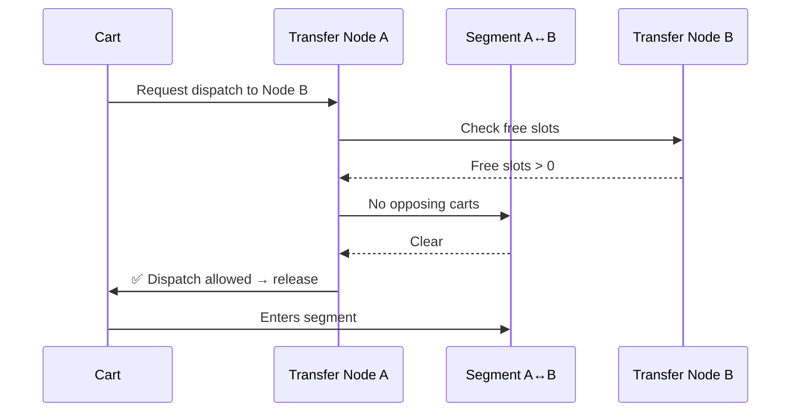
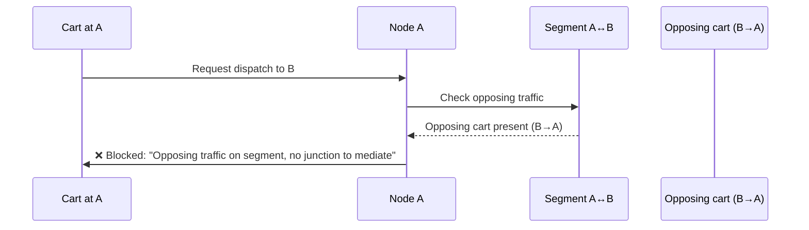
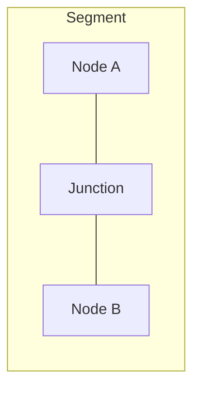
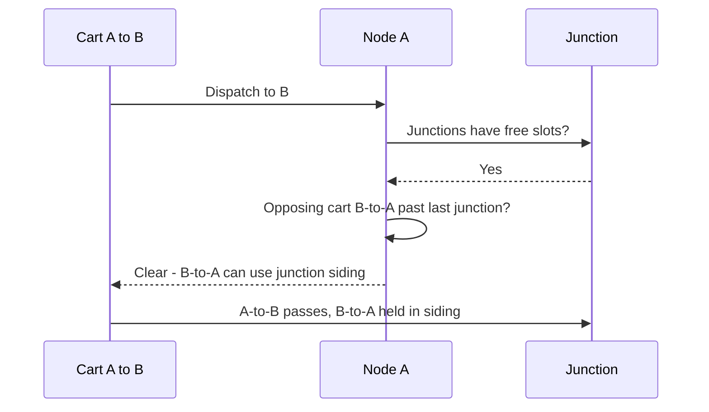
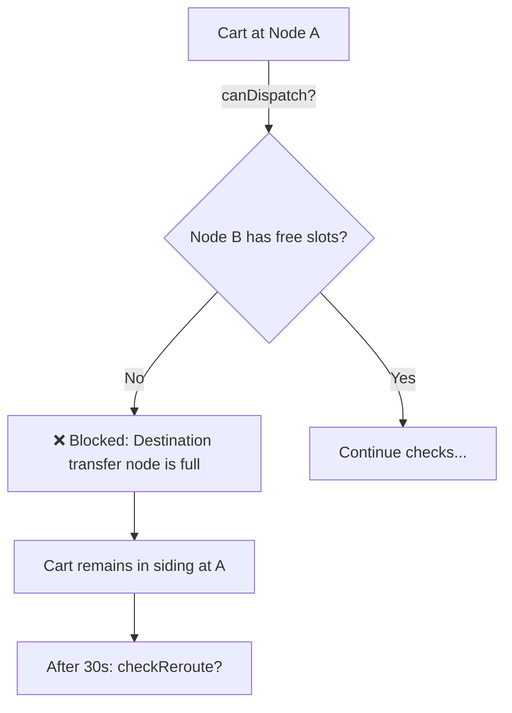
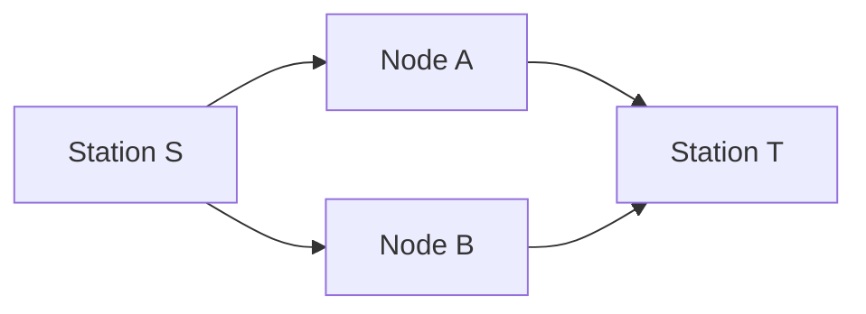

# Netro — Functionality Overview

Netro is a Minecraft rail network plugin that manages **stations**, **transfer nodes**, **junctions**, and **cart routing** so multiple minecarts can share track safely with destination-based routing and backpressure.

**Physical setup (detectors, controllers, copper bulbs, wands):** see **[docs/DESIGN_DETECTORS_CONTROLLERS.md](DESIGN_DETECTORS_CONTROLLERS.md)**.

---

## 1. What Netro Does

| Area | Purpose |
|------|--------|
| **Stations** | Named locations; address is auto-assigned from world coordinates. |
| **Transfer nodes** | Endpoints at a station that connect to one other station. Two paired nodes form a bidirectional link. Created via detector placement or absorb; paired with the **pairing wand**. |
| **Terminals** | Dead-end platform nodes at a station (same station as origin and destination). |
| **Junctions** | Sidings on a segment between two nodes so opposing carts can pass. Created from a **pair of detectors**; segment registered with the **segment wand**. |
| **Routing** | Dijkstra over the node graph; per-station routing tables (next-hop by destination). |
| **Dispatch** | Before release: downstream capacity, opposing traffic, junction occupancy, distance-based arrival when junctions exist; reroute after timeout. |
| **Signals** | Lecterns via `/signal register` or `add`; bindings drive comparator output. |

---

## 2. Commands (summary)

| Command | Description |
|---------|-------------|
| **`/station`** | Create or manage stations; `[Station]` sign or `/station create`. |
| **`/transfer`** | Create/link transfer nodes: `create`, `done`, `list`, `pair`, `terminal`, `status`, `info`, `test`. Use **pairing wand** to link two nodes. |
| **`/terminal`** | Create/manage terminals: `create`, `done`, `list`, `status`, `info`. |
| **`/junction`** | Create/manage junctions: `create`, `setup`, `done`, `list`, `info`, `segment`. Use **segment wand** to register segment (transfer A → junction(s) → transfer B). |
| **`/absorb`** | Re-register station/detector/controller signs (e.g. after DB recreate). |
| **`/setdestination`** | Set a cart’s destination (address or station name). |
| **`/dns`** | Browse/lookup stations. |
| **`/signal`** | Station signals and lecterns: `register`, `add`, `bind`, `list`. |
| **`/route`** | Named display routes: `create`, `list`, `info`, `delete`. |

Full command details and wand usage: **DESIGN_DETECTORS_CONTROLLERS.md** (Command Summary).

---

## 3. Scenario Diagrams

The following diagrams show dispatch behaviour. **Green** = allowed, **Red** = blocked, **Yellow** = conditional.

### 3.1 Simple segment: dispatch allowed

When there is **no opposing traffic** and the **destination node has free capacity**, the cart is allowed to leave.



---

### 3.2 Simple segment: blocked (opposing traffic, no junction)

If the segment has **no junction** and there is **opposing traffic**, dispatch is blocked.



---

### 3.3 Segment with junction: opposing traffic mediated

A **junction** provides a siding so one cart can wait while the other passes. Dispatch is allowed if the opposing cart is not committed past the last junction and junction sidings have free slots.





---

### 3.4 Backpressure: destination node full

If the **destination transfer node has no free capacity**, dispatch is blocked.



---

### 3.5 Reroute after timeout

If a cart has been **held longer than the reroute timeout** and the primary next-hop is blocked, the engine can **look up an alternate next-hop**.



---

### 3.6 Address resolution: station vs terminal

| Address type | Example | Meaning |
|-------------|---------|---------|
| Station | `2.4.7.3` | Any terminal at that station |
| Terminal | `2.4.7.3.1` | Specific terminal at station `2.4.7.3` |

---

### 3.7 Gate slot fill order (direction-aware)

Hold siding slots are ordered by distance to the station (slot 0 = nearest). Fill order depends on direction so the “front” of the queue is correct for release. (See DESIGN for detector/controller semantics.)

---

## 4. Summary: dispatch outcomes

| Condition | Result |
|-----------|--------|
| Destination node has no free slots | ❌ Blocked — “Destination transfer node is full” |
| No junction, opposing traffic on segment | ❌ Blocked — “Opposing traffic on segment, no junction to mediate” |
| Junction(s), opposing cart committed past last junction | ❌ Blocked — “Opposing cart committed past last junction” |
| Junction siding full | ❌ Blocked — “Junction &lt;name&gt; siding is full” |
| All checks pass | ✅ Clear — cart can be released |

---

## 5. Data flow (high level)

```mermaid
flowchart TB
    subgraph Inputs
        CMD[Commands]
        CART[Cart events]
        SIGN[Sign / block events]
    end

    subgraph Netro
        DB[(SQLite)]
        ROUTE[RoutingEngine]
        SIGNAL[SignalEngine]
        ROUTE --> DB
        SIGNAL --> DB
    end

    subgraph Outputs
        BULB[Copper bulb (controller)]
        PRESSURE[Station pressure]
    end

    CMD --> DB
    CART --> ROUTE
    SIGN --> ROUTE
    ROUTE --> BULB
    ROUTE --> PRESSURE
```

---

*Schema and code: see `schema.sql` and `src/main/java/dev/netro/`. Design and commands: **DESIGN_DETECTORS_CONTROLLERS.md**.*
